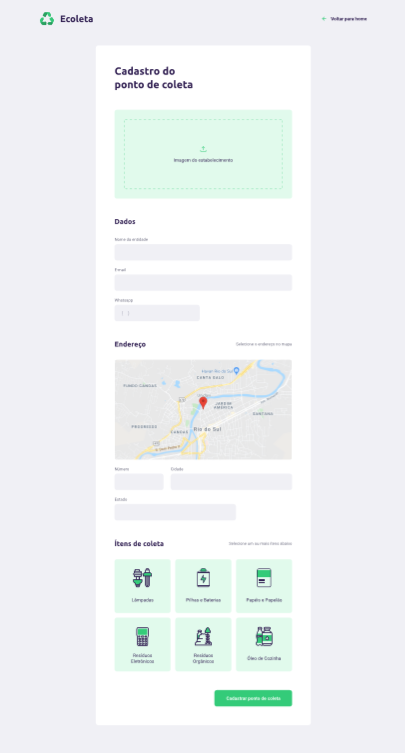
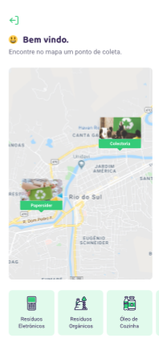
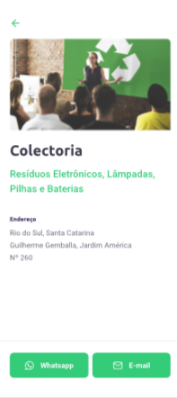

# Ecoleta  #
O Ecoleta é uma ferramenta para conectar aqueles que buscam fazer o descarte
correto de resíduos. Com ele fica fácil encontrar lugares na localização do usuário envolvidos na coleta de resíduos em determinadas categorias. 

------------------------------------
 ## 🌼  Tecnologias utilizadas ##
* React
* React Native
* Typescript
* Express
* Node.js
* Expo

 ## 🌼  Versões ##
### - Web ###
A versão web do projeto consiste no gerenciamento da ferramenta, onde serão criados os pontos de coleta de resíduos.

### - Mobile ###
A versão mobile será utilizada pelos usuários encontrarem pontos de coleta próximos a sua localização atual, baseada no GPS do dispositivo. 

## Resultados ##
### - Web ###

### - Mobile ###

### ❤️ Agradecimentos ###

O projeto foi desenvolvido durante a semana NLW da 
[Rocketseat](https://rocketseat.com.br) 
.
